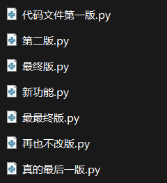
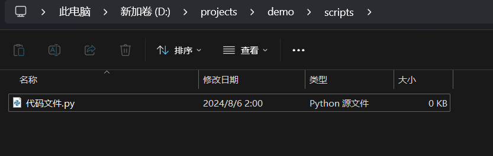
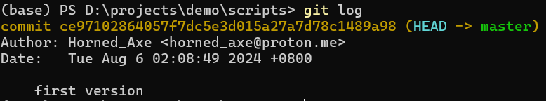
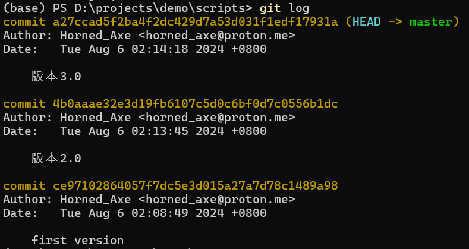
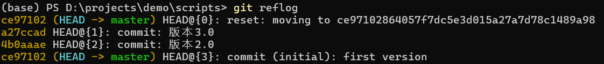
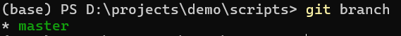
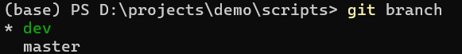

# 写给同僚的教程————git入门

# git? github?

简而言之，git是一个**版本控制工具**，github是一个**代码托管平台**。

或许有的朋友仍然一头雾水，别急着退出，让我们举个例子



相信有的朋友已经开始呼吸困难了，而如果考虑到与此同时你同事代码的血管里流淌着三百个依赖和数不清且找不出的bug，相信大家都会明白，**版本控制**对于降低心脑血管疾病发病率的价值所在

# 那么这么好的git在哪里可以买到呢？

不要998不要198，点点链接当场免费送到家

[git下载](https://git-scm.com/downloads)

安装完成后可以使用`git --version`查看是否安装成功

# git的基本使用

## 1. git init

`git init`命令用于在当前目录新建一个Git仓库，生成一个`.git`目录，用于存放版本库的管理和配置文件，`.git`目录中包含了所有的版本信息，如果删除了这个目录，git存储的版本信息也会丢失

可以简单理解为，`.git`文件夹中压缩存储了这个项目所有的版本，让我们能够方便的回溯到过去或者切换不同的版本

## 2. git add

`git add`命令用于将文件添加到暂存区，通常来说，我们可以直接在工作区使用`git add .`命令将所有文件添加到暂存区

`.`是从unix流传下来的祖宗之法，表示当前目录，相同风格的路径表示法还有`..`表示上一级目录

## 3. git commit

`git commit`命令用于将暂存区的文件提交到本地仓库，通常来说，我们可以使用`git commit -m "message"`命令提交文件到本地仓库

`-m`参数表示提交的信息，这个信息会在版本历史中显示，方便我们回溯到过去

## 半场开香槟

恭喜你，你已经学会了git的基本使用，接下来让我们试试上手实操一下git的使用，以

为例

首先，假设我们已经完成了项目的第一个稳定版本



接下来，我们需要将这个版本提交到本地仓库

```shell
git init
git add .
git commit -m "first version"
```

然而，假如您真的尝试跟着这个流程操作（或许？），您会发现，这里弹出了一个错误

```shell
Author identity unknown

*** Please tell me who you are.

Run

  git config --global user.email "you@example.com"
  git config --global user.name "Your Name"

to set your account's default identity.
Omit --global to set the identity only in this repository.
```

在这里配置的用户名和邮箱将来会在提交的信息中显示，方便我们追溯到提交的人员（事实上不填真实邮箱也并不会立即出问题）（如果愿意的话）

配置好用户名和邮箱，我们再次尝试提交

```shell
git commit -m "first version"
```

这时候，我们已经完成了第一个版本的提交，我们可以使用`git log`查看提交的历史



可以看到，第一个版本的提交已经完成，之后随时可以回溯到这个版本（如果没有删除`.git`文件夹的话）

让我们再多提交几个版本



好，那么假如这个时候我们需要回溯到第一个版本，我们可以使用`git reset --hard commit_id`命令来进行回溯，`commit_id`是我们需要回溯的版本的id，也就是`git log`中的`commit`后面的一串字符，在我们的例子中，第一个版本的`commit_id`是`ce97102864057f7dc5e3d015a27a7d78c1489a98`

```shell
git reset --hard ce97102864057f7dc5e3d015a27a7d78c1489a98
```

这个时候你会发现，我们的项目，包括代码文件（工作区）与提交历史，已经回溯到了第一个版本


但是这个时候我们也会注意到，新版本的代码在这个硬回退的操作中丢失了，那么，我们能否在保留新版本的同时回退到旧版本呢？

答案是肯定的，首先，在git中，一切操作都是可撤销的，也包括硬回退在内，我们可以硬回退硬回退，当然也可以硬回退硬回退硬回退抱歉

我们可以使用`git reflog`命令查看我们的操作历史



可以看到，我们的硬回退操作已经记录在了操作历史中，我们可以使用`git reset --hard commit_id`命令再次回溯到新版本

```shell
git reset --hard a27ccad
```

这样，我们就完成了把硬回退（名词）硬回退（动词）掉，而与此同时我们也可以尝试使用另一种方式来保存新版本的代码，我们可以进行**分支**

## 4. git branch

`git branch`命令用于查看当前分支，我们可以使用`git branch`命令查看当前分支



可以看到，我们当前只有一个`master`分支，这个分支是git默认创建的分支，我们可以使用`git checkout -b branch_name`命令创建一个新的分支

```shell
git checkout -b dev
```

这个时候我们就创建（并且检出代码到）了新的`dev`分支，我们可以使用`git branch`命令查看当前分支



可以看到，我们当前在`dev`分支上，我们可以在`dev`分支上进行代码的修改，然后提交到`dev`分支上，而`master`分支上的代码不会受到影响，而在`master`分支上的代码回退也不会影响到`dev`分支，比如我们现在检出到`master`分支，然后回退到第一个版本

```shell
git checkout master
git reset --hard ce97102864057f7dc5e3d015a27a7d78c1489a98
```

我们可以看到，`master`分支上的代码已经回退到了第一个版本，而如果我们检出到`dev`分支，我们会发现`dev`分支上的代码并没有受到影响（事实上我非常推荐您亲自动手试一试）

## 5. git clone

`git clone`命令用于克隆一个远程仓库，我们可以使用`git clone url`命令克隆一个远程仓库，而在这里，我们会遇到我们的老朋友，github

正如我们在最开始提到的，github是一个**代码托管平台**，这意味着，我们可以将我们的代码上传到github上，然后在任何地方（包括别人的电脑上）将代码克隆下来，这样就可以在不同的设备上协作开发，而不用担心代码的不同步或者丢失

我们可以在github上创建仓库，然后将我们的代码上传到github上，之后就可以使用`git clone url`命令将代码克隆到本地，或者大部分情况下，我们会将别人的代码克隆到本地

## 6. git push

`git push`命令用于将本地仓库的代码推送到远程仓库，我们可以使用`git push origin branch_name`命令将本地仓库的代码推送到远程仓库的`branch_name`分支上

不过在此之前，我们需要先将远程仓库的地址与`origin`关联，我们可以使用`git remote add origin url`命令将远程仓库的地址与`origin`关联

进一步解释的话，使用`git push origin branch_name`来推送代码，意味着将本地的`branch_name`分支推送到`origin`绑定的远程仓库的`branch_name`分支

## 7. git pull

`git pull`命令用于将远程仓库的代码拉取到本地仓库，我们可以使用`git pull origin branch_name`命令将远程仓库的`branch_name`分支拉取到本地仓库

好了，git的基本使用其实就是这样，或许命令有点多，但是相信从刚才的例子中大家也能看出，花一点时间使用git，可以节省多得多的时间（与降压药），如果想要进一步学习，我推荐下面的视频教程

[【GeekHour】一小时Git教程](https://www.bilibili.com/video/BV1HM411377j/?share_source=copy_web&vd_source=fe6e733937ba46eab3ca1e96fcf45896)

# 完结撒花